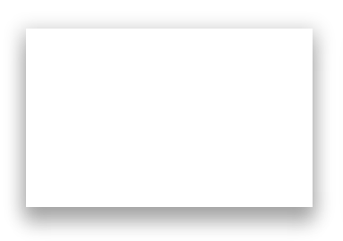

# Material Shadow

Material shadow is a basic css library that provides material shadow shadings of one through five.

# How to install

`npm install material shadow`

Or alternatively use git clone

# How to use

There are 10 total css classes that you can use to give your desired element a shadowed effect.

* .shadow-1
* .shadow-2
* .shadow-3
* .shadow-4
* .shadow-5

To get a hover effect at one of the following classes respectively

* .shadow-1-hover
* .shadow-2-hover
* .shadow-3-hover
* .shadow-4-hover
* .shadow-5-hover

